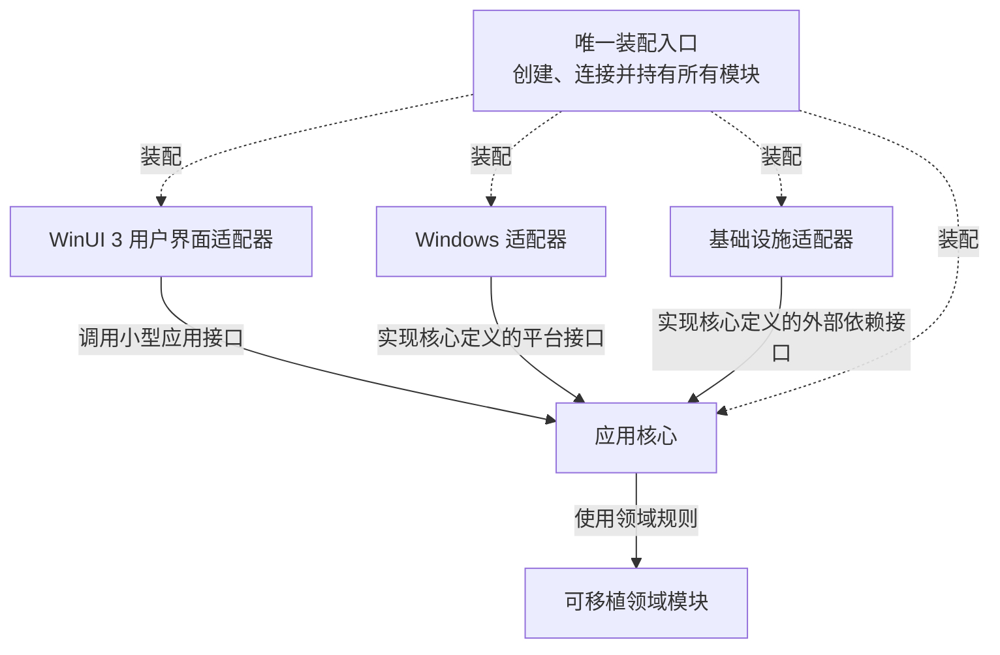

# 架构与代码质量规范

状态：已确认  
适用范围：初装工作台首版及后续演进

## 1. 目的

本文件把“易维护、低耦合、高内聚、前后端分离并保留扩展性”落实为可检查的工程规则。这些规则与功能正确性同为发布门槛：功能暂时可用，不能成为界面直接操作系统、业务规则重复、模块循环依赖或全局状态失控的理由。

这里的“前后端分离”是同一个桌面进程中的职责和代码分离：WinUI 3 用户界面是前端，应用核心及其适配器是后端。它不引入独立后台进程、本地 Web 服务或进程间网络通信，也不改变“关闭工作台即不再启动新操作”的产品语义。

## 2. 统一工程语言

- **模块**：拥有一个明确接口和一套隐藏实现的代码组织单位，可以大到一个构建目标，也可以小到一个类。
- **接口**：调用者正确使用模块所需知道的全部内容，包括输入输出、约束、调用顺序、错误结果、配置要求和性能特征，不只是一组函数声明。
- **接缝**：允许在不修改调用者的情况下替换行为的位置；模块接口位于接缝上。
- **适配器**：在接缝处实现接口、把核心意图转换为具体平台或基础设施操作的模块。
- **深模块**：用较小接口封装较多稳定行为，为调用者提供高复用价值，并把变更、故障知识和验证集中在一处。
- **装配入口**：进程启动时创建具体模块、注入依赖并管理其生命周期的唯一位置。

项目使用这些术语描述代码结构，不用含义模糊的“万能管理器”“公共工具层”代替真实职责。

## 3. 同进程模块化单体

初装工作台采用同进程模块化单体。一个 Windows 可执行程序内包含多个职责清楚的模块；模块通过显式接口协作，但共同使用一个进程、一个常驻管理员会话和一套一致的关闭与恢复语义。

图中的实线表示源码依赖方向，不表示运行时控制流。应用核心可以在运行时通过接口请求适配器执行操作，但接口由内侧核心拥有，具体适配器反向依赖该接口。

### 3.1 WinUI 3 用户界面适配器

- 使用 XAML 和 C++/WinRT 接收用户意图、呈现核心状态快照，并把平台输入转换为核心可理解的类型。
- 只拥有焦点、滚动位置、展开状态、动画进度以及每显示器 DPI、显示缩放、工作区和图形能力等短暂显示状态；这些状态只决定呈现，不能成为业务状态或第二写入入口。
- 不解析目录规则，不规划依赖，不决定重试、恢复、风险、执行顺序或成功语义。
- 不直接修改注册表、配置文件、进程、下载任务或持久化业务记录。
- 图形化软件目录编辑器只提交类型化的编辑、保存草稿和应用意图，并呈现核心返回的目录编辑草稿、当前有效目录、运行时加载结果、正式发布门禁结果与本机试用身份；XAML 页面不直接解析、序列化或写入 TOML，也不自行判断目录是否可用、可发布或何时生效。
- 动效只呈现已经确定的视觉状态；统一时长、系统动画偏好和输入方式由界面层集中管理，页面不得让动画完成事件提交业务状态或触发系统操作。
- 不把 WinUI 3 控件、页面、调度器或 Win32 类型暴露给应用核心。

### 3.2 应用核心

- 通过用例级接口接收用户意图，协调规划、执行、暂停、恢复、重试、结果确认和日志语义。
- 拥有业务状态转换和跨步骤的一致性规则，是用户界面获取业务状态的唯一入口。
- 使用可移植领域模块完成规则计算，通过核心定义的接口请求外部效果。
- 对不产生系统修改、彼此独立且可合并结果的 CPU 密集型工作，核心统一拥有受限并行调度及其上限、取消、异常与结果合并语义；页面和适配器不得各自创建工作线程或维护第二份业务状态。该调度不能改变安装、系统优化、软件优化、权威提交、结果确认或恢复判断的串行与互斥边界。
- 统一协调调试模式偏好、目录编辑、未保存修改恢复、保存草稿、删除草稿、应用目录、草稿校验和结构化诊断事件；保存只更新并持久化目录编辑草稿，正常关闭和重新打开后恢复为“已保存未应用”，删除草稿只移除候选内容。核心拥有未保存修改事实和主动关闭决策：在同一次工作台运行期间，页面导航、标准视图与高级视图切换或关闭调试模式只改变呈现与偏好，不触发关闭决策，不得自动保存、放弃或应用未保存修改；核心继续持有修改，使编辑器重建后仍呈现“未保存更改”。只有用户真正关闭工作台且存在未保存修改时，核心才返回保存草稿并关闭、仅放弃未保存修改或返回编辑三种类型化结果，保存成功前不得完成关闭，任一路径都不得应用目录。进程异常退出或断电后，核心尽量恢复未保存的编辑内容，并把它作为“恢复的未保存修改”与此前已保存草稿、当前有效目录分别建模；恢复不得覆盖或损坏后二者，失败不得伪报成功。恢复内容仍是未保存状态，应用请求必须在界面和核心中被拒绝；显式保存成功后才转为“已保存未应用”并清除对应恢复状态，放弃只移除恢复部分。应用必须重新校验当时已保存内容并完整切换当前有效目录，任何草稿都不能在恢复时自动应用，调试界面不能绕过与文件加载相同的目录规则。核心分别计算运行时加载结果与正式发布门禁结果，但保持“运行时通过是正式发布通过的必要条件”这一不变量；运行时通过但发布未通过时可以按显式用户意图应用或导入为本机试用目录，运行时失败时发布结果不能通过，任何入口都不得修改 `release_state` 或发布结论。
- 返回带有明确状态和错误语义的类型化结果或只读状态快照，不让调用者拼装业务结论。
- 不依赖 WinUI 3，不在内部自行查找或创建具体 Windows、网络、文件、时钟或持久化实现。

### 3.3 可移植领域模块

- 按稳定业务能力聚合目录语义、选择与依赖规划、批次状态、恢复规则和结果判断等逻辑。
- 软件目录的文件加载与图形化编辑共享同一套纯领域模型、模式约束和校验结果，不为编辑器复制第二套规则。
- 优先使用纯计算和显式输入输出，不访问用户界面、Win32、网络、文件系统或设备状态。
- 每个模块围绕一个内聚能力提供小型接口，内部可以继续划分私有实现和仅供自身测试使用的内部接缝。
- 未来 macOS 版本复用确实跨平台的领域模块和数据契约，不为复用而把 Windows 行为伪装成通用行为。

### 3.4 Windows 适配器

- 实现注册表、配置、进程、硬件、安装程序、权限、重启屏障和受限 UI Automation 等 Windows 专属接口；UI Automation 只能执行核心已授权的非身份安装器交互，不得读取、代填、传递或保存登录、注册、验证码、付款或个人资料内容，这些步骤只由用户在软件厂商官方界面完成。
- 只负责可靠执行或观测核心已经决定的意图，并返回类型化事实、结果和必要诊断。
- 不拥有目录选择、风险确认、重试策略、批次状态或“是否成功”的最终业务规则。
- 平台实现细节、句柄和 Windows 类型不得穿过接缝进入应用核心或可移植领域模块。

### 3.5 基础设施适配器

- 实现下载、网络访问、文件读写、持久化、日志输出、时间和其他外部依赖接口。
- 目录文件适配器只负责可靠读取与写入核心已经验证的 TOML 兼容数据；日志适配器接收结构化诊断事件，在落盘前执行集中脱敏和粒度过滤，并按核心定义的版本化诊断合同生成单个自包含导出文件。脱敏合同明确区分可保留的非唯一硬件型号、驱动版本、网络状态和规范化路径，与必须排除或匿名化的凭据、计算机名、用户名、唯一设备标识、MAC/IP、SSID、用户目录名称和敏感 URL；环境摘要、状态语义、当前有效目录的维护发布状态与本机试用身份、目录应用关联标识和相关批次上下文由其各自所有者提供，日志适配器不得自行猜测业务结论。
- 尽可能提供可移植实现，但“可移植”不能以泄漏第三方库类型或削弱 Windows 可靠性为代价。
- 只报告外部事实和操作结果，不在适配器中复制来源优先级、缓存政策、状态转换或恢复规则。

### 3.6 唯一装配入口

- 只有装配入口知道全部具体适配器类型、运行环境和生命周期配置。
- 装配入口创建依赖并显式注入模块；模块不得通过全局查找器、静态单例或隐藏工厂自行取得依赖。
- 装配入口不承载业务判断，只完成对象创建、所有权连接、启动和有序关闭。
- 生产适配器与测试适配器在同一接缝处替换，调用者和业务规则不随之改变。

## 4. 单向依赖规则

源码依赖必须保持单向：

1. 可移植领域模块不依赖应用核心、用户界面或具体适配器。
2. 应用核心可以依赖可移植领域模块，并拥有其所需外部效果的接口。
3. Windows 与基础设施适配器依赖核心定义的接口，而不是让核心依赖其具体实现。
4. WinUI 3 用户界面适配器只依赖应用核心面向用户界面的接口和稳定数据类型。
5. 唯一装配入口可以依赖所有具体模块，但任何其他模块不得反向依赖装配入口。

跨模块调用只能通过声明的接口和类型化数据完成，不能访问另一模块的私有对象、存储格式、文件路径或可变容器。模块间不得形成直接循环，也不得借共享回调、全局事件总线或静态对象形成隐藏循环。

并非每个类都需要抽象接口。只有行为确实需要替换时才建立接缝；生产适配器与无副作用测试适配器构成真实的两种实现。单一、稳定且仅在模块内部使用的实现保持私有，避免为了形式分层制造浅薄的转发模块。

## 5. 状态的唯一来源

“唯一来源”表示每一项业务事实只有一个可写所有者，而不是把所有数据塞进一个全局对象。

- 应用核心拥有批次、流程、确认、恢复和结果状态；持久化适配器保存它们，但不自行解释或改变语义。
- 目录模块拥有已加载目录及其校验结果；用户界面不能维护一份可独立修改的目录副本。
- 目录模块分别拥有当前有效目录、目录编辑草稿和未保存修改；三者必须是显式类型和状态转换。“保存草稿”不得改变当前有效目录，已经保存但尚未应用的草稿通过持久化适配器跨正常关闭和重新打开恢复为“已保存未应用”，直至用户继续编辑、明确应用或删除。删除草稿不得改变当前有效目录、既有批次或历史；只有“应用”用例对当前已保存内容重新执行既有加载校验并成功完整替换后才能生效，失败、部分写入、页面重建、关闭调试模式或进程重新启动都不得把未应用草稿误当作当前有效目录。同一次运行中的未保存修改也由目录模块拥有；页面重建、窗口导航、视图切换和关闭调试模式不得清除、持久化或应用这些修改，重新打开编辑器时应从同一核心状态重建“未保存更改”。异常退出或断电后成功找回的内容仍由目录模块作为“恢复的未保存修改”持有，不能覆盖已保存草稿或当前有效目录；它只有在显式保存成功后才转为“已保存未应用”，放弃与恢复失败也只能改变恢复状态和恢复内容。本机试用身份是当前有效软件目录根据运行时加载结果和正式发布门禁结果得到的持久属性，不是第三份目录、界面临时状态或另一写入入口；关闭调试模式不得撤销或隐藏这一身份。
- 调试模式偏好只有一个可写所有者；页面、日志适配器和目录编辑器不得分别维护可能互相矛盾的启用状态。
- Windows 与基础设施适配器返回系统观测值，应用核心负责把观测值与当前流程状态协调成业务结论。
- 用户界面只呈现核心状态快照。页面重建、窗口导航或视图切换不能丢失或重置业务状态。
- 同一状态不得同时由 XAML 页面、全局单例、执行器和持久化记录分别写入；所有业务变更都通过应用核心的用例接口发生。
- 显示专用的短暂状态可以留在用户界面，但不得决定操作是否执行、是否成功或能否恢复。

业务状态更新、持久化结果和日志事件必须由同一个用例协调，使崩溃恢复不会面对多份互相矛盾的事实。需要缓存状态时，缓存必须能从权威来源重建，且不能成为新的写入入口。

## 6. 深模块与小型接口

每个对外可见模块只提供一个经过设计的接口，并尽可能做到：

- 以少量用例级操作代替暴露大量内部步骤；调用者表达“要完成什么”，实现隐藏“具体怎样完成”。
- 使用受约束的值类型、请求和结果，避免布尔参数串、裸字符串操作码和需要调用者记忆的隐式顺序。
- 接受已注入依赖，不在业务方法中创建真实网络、文件、Windows 或时间依赖。
- 返回可检查结果，不把关键结论分散到日志、副作用和多个回调中。
- 在接口说明中明确约束、顺序、错误、取消、线程和性能语义；减少方法数量不能以隐藏必要合同为代价。
- 由调用者和测试共同通过同一接口使用模块；内部重构不应迫使调用者和合同测试一起改写。

模块应通过“删除检验”：如果删除模块后，原本封装的复杂规则会重新散落到多个调用者，说明模块产生了深度与复用价值；如果删除后只少了一层转发，说明它是浅模块，应合并或重新划分接缝。

高内聚意味着相关规则、状态和验证集中在拥有该业务能力的模块内；低耦合意味着其他模块只需要知道稳定接口。不能为了追求更小文件把一个完整行为拆成需要调用者按固定顺序拼装的许多薄层。

## 7. 受控扩展模型

### 7.1 目录内容扩展

新增普通软件、来源、驱动入口、系统设置项或软件优化方案时，先判断现有内置受控能力是否足以表达。凡只使用已有能力类型的内容，都必须通过相应目录包表达，并做到：

- 增加或修改经过模式校验的目录数据，不修改现有页面、主流程或无关功能模块；
- 使用稳定标识、版本化模式和已建模的受控操作声明，由核心统一校验、规划和记录；
- 只引用工作台已经内置并允许的能力及其受约束参数，不能携带 DLL、脚本或其他可执行代码；
- 目录导入、更新或回退不能绕过风险确认、执行互斥、状态检测、恢复和日志规则。

目录是数据扩展接缝，不是任意代码执行入口。即使目录来自手动导入，它也不能获得超出当前工作台内置能力的管理员操作范围。

调试模式中的图形化软件目录编辑器只是该数据接缝的维护界面。它只能表达版本化模式已有字段并调用同一核心校验，不能直接访问执行器、注册表、进程或网络能力，也不能通过自由文本字段引入命令、脚本、插件或未建模参数。

### 7.2 内置受控能力扩展

当新需求无法用已有能力类型准确、安全地表达时，才增加新的内置受控能力：

1. 在拥有该行为的核心模块中定义小型接口、输入约束、结果和失败语义。
2. 为 Windows 或基础设施效果增加具体适配器，并同时提供无副作用测试适配器。
3. 通过唯一装配入口登记和注入能力，不让页面或目录直接创建实现。
4. 补齐无用户界面自动测试、适配器合同测试和架构检查。
5. 扩展版本化目录模式，并保证未知执行语义或未知能力使旧版本拒绝整份候选目录、保留当前有效目录，而不是尝试执行。

新增能力类型可以扩展通用呈现，但不得要求修改与其无关的页面和业务流程。若一次新增功能仍需在多处复制判断，应先重新设计模块接口，而不是继续增加条件分支。

### 7.3 禁止第三方代码插件

首版及既定扩展模型不加载第三方 DLL、脚本、PowerShell 模块、Wasm 模块或其他可执行插件，也不提供让目录指定任意命令、代码入口或动态库的机制。所有获得常驻管理员权限的可执行能力都必须随项目维护的工作台构建并经过同一检查和发布流程。工作台按目录规则启动的软件厂商官方安装程序属于受控操作对象，不是工作台能力模块或第三方插件。

这一限制保留了目录数据扩展和项目内置模块扩展，同时明确放弃未经项目审核的插件生态。未来若重新考虑第三方代码，必须另立安全模型和 ADR，不能通过放宽目录字段悄然引入。

## 8. 禁止的结构

以下情况视为架构缺陷，不能因功能可以运行而接受：

- 模块直接或间接循环依赖；
- 用户界面直接执行系统、下载、持久化或目录业务操作；
- 同一业务规则在页面、核心和适配器中分别实现；
- 跨功能全局可变状态、全局事件总线或可随处取得的依赖定位器；
- 以 `Utils`、`Helpers`、`Common` 或 `Manager` 聚合无共同业务所有者的逻辑；
- 只做参数转发却扩大接口面积的浅模块和多层包装；
- 让一个模块读取或修改另一模块的内部存储、缓存或文件格式；
- 把 WinUI 3、Win32 或第三方库类型泄漏进可移植核心接口；
- 通过布尔组合、裸字符串和隐式约定承载关键业务状态；
- 为尚不存在的变化建立大量接口，或为测试方便把私有实现暴露成公共接口。

真正跨模块复用的基础值类型可以进入小型公共模块；仅仅在两个地方碰巧相似的代码不能直接进入“公共工具”。共用前必须先确认同一语义、同一变化原因和明确所有者。

## 9. 自动检查与测试接缝

### 9.1 无用户界面自动测试

核心功能必须能在不启动 WinUI 3、无需管理员权限、无网络且不修改真实电脑的环境中自动检查：

- 可移植领域模块直接验证目录、规划、冲突、状态转换和结果规则；
- 应用核心使用内存状态库、固定时钟以及 Windows、下载、文件和日志测试适配器验证完整用例；
- 目录编辑用例使用内存目录文件适配器验证增删改、保存草稿不生效、已保存未应用草稿跨正常关闭、异常退出、断电后重新打开仍保留且绝不自动应用、仅有已保存草稿时正常关闭不弹未保存确认、重开后的已保存草稿可继续编辑或明确应用、删除草稿不改变当前有效目录和既有记录、已有已保存草稿后产生未保存修改时应用请求被拒绝且既不应用旧草稿也不隐式保存新修改、同一次运行中切换页面、切换标准视图与高级视图及关闭调试模式均不弹关闭确认、不丢失修改且不自动保存或应用、重新打开编辑器仍显示未保存状态、主动关闭时三项选择、保存成功关闭后重开为更新后的“已保存未应用”且当前有效目录不变、保存失败保持打开与修改且不部分覆盖此前已保存版本、放弃未保存修改后保留此前草稿、返回编辑取消关闭且三条路径均不应用目录、调试模式关闭后的临时编辑会话只能编辑、保存或放弃且应用请求在界面与核心中均被拒绝、异常退出或断电后成功找回时显示“恢复的未保存修改”且不覆盖已保存草稿或当前有效目录、恢复后应用请求被拒绝、显式保存后转为“已保存未应用”并清除恢复状态、放弃恢复部分不影响既有状态、恢复失败不伪报成功、正常应用时重新校验、运行时整包失败时保留旧目录与草稿、局部依赖错误随新目录切换并禁用受影响项、运行时通过但 `release_state = "draft"` 或存在其他仅发布级问题时应用为本机试用目录、应用不改变发布状态且发布流程仍拒绝、关闭调试模式不撤销试用身份、既有批次快照不变，以及有效内容的 TOML 兼容往返。调试日志使用内存日志适配器验证粒度切换、敏感信息脱敏、自包含导出、本机试用身份与目录应用关联标识和采集缺口标记。
- 诊断合同测试注入目录、来源、下载、安装程序、恢复和异常退出等代表性故障；只把单个导出文件交给测试读取端时，读取端仍须还原构建与环境摘要、用户命令、关联事件链、失败组件与阶段、原始错误和最后可信状态，不得依赖测试机、界面截图或另一份人工说明。
- 使用可控测试调度器验证单核路径、受限并行上限、取消、异常和结果合并与串行计算具有相同业务结论；并行内部计算不能改变批次顺序、跨实例互斥、权威提交、结果确认或恢复语义，也不能并行启动安装器或系统、软件优化。
- 测试通过与生产相同的模块接口输入意图并观察结果，不读取私有状态或依赖页面控件；
- 失败、取消、重启、恢复、并发互斥和部分完成路径与正常路径具有同等验证地位。

用户界面自动化或真实 Windows 验证可以补充界面和平台证据，但不能替代这些无用户界面检查。未进行真实设备验证时，仍按项目既有规则在开发者发布证据中标记“未实机验证”。

### 9.2 适配器合同测试

每个真实适配器与其测试适配器必须满足同一接口合同，包括成功、失败、取消、重复调用、资源清理和诊断语义。合同测试只断言接缝可观察结果，不把具体注册表、网络库或存储实现细节固化进应用核心测试。

涉及真实系统变更的适配器应在可丢弃、隔离的测试环境中验证；无法安全自动运行的真实设备场景保持独立证据状态，不能用模拟合同测试冒充实机通过。

### 9.3 架构检查

构建与持续检查至少验证：

- 构建目标和头文件依赖图无循环；
- 可移植领域模块不引用 WinUI 3、Win32 或具体适配器；
- 生产代码中除适配器自身实现外，只有装配入口跨模块引用具体适配器并完成生产装配；
- 用户界面不链接系统修改与基础设施实现模块；
- 目录内容扩展不能加载可执行插件或越过内置能力注册表；
- 图形化目录编辑器不直接链接目录文件或执行适配器，调试模式也不能关闭校验、脱敏与架构门禁；本机试用路径不能修改或伪造正式发布门禁结果，也不能把试用目录送入发行制品；
- 接口合同测试和核心无用户界面测试能够独立运行。

自动检查无法完整判断高内聚、接口深度和规则重复，因此评审仍需使用删除检验、状态所有权和依赖方向逐项检查。自动检查或评审发现本文件所列硬性缺陷时，必须先修复再发布。

## 10. 先进性服从可维护性

- C++26、WinUI 3、Windows App SDK、编译器和依赖优先采用满足产品约束的最新稳定方案。
- 新语言特性或库只有在提高类型安全、资源管理、可读性、测试性或平台支持时才进入生产代码。
- 不为展示新颖性采用预览工具、冷门框架、复杂元编程、隐藏控制流或团队难以诊断的抽象。
- 不把实验技术写入持久格式、目录合同或稳定模块接口；先在可删除的隔离原型中验证。
- 新方案若让接口变大、状态所有权模糊或模块更难替换，即使技术更新也不采用。
- 影响稳定接缝、持久格式或平台迁移窗口的重大技术变更必须单独评审并记录 ADR。

最新不等于先进。对本项目而言，能够长期维护、可靠验证、清楚扩展并保留可移植核心的最新稳定方案，才属于先进方案。

## 11. 完成标准

一项代码变更只有同时满足以下条件，才达到本规范的完成标准：

- 业务规则归属明确，未在用户界面或适配器中出现第二份实现；
- 新增依赖方向符合本文件，未形成直接或隐藏循环；
- 每项业务状态只有一个可写所有者，用户界面可从核心状态重建；
- 普通目录内容扩展不修改无关页面和主流程；
- 新能力通过内置模块、明确接缝和唯一装配入口接入；
- 关键接口保持小型、类型化且完整描述错误与取消语义；
- 无用户界面自动测试、合同测试和架构检查通过；
- 每显示器 DPI、显示缩放、图形能力等呈现状态只由界面适配器拥有，受限并行工作只由核心统一调度，二者都不形成第二份业务状态或越过受控操作的串行边界；
- 调试模式、目录编辑草稿、当前有效目录和日志粒度各自保持明确状态所有权，运行时加载结果、正式发布门禁结果和本机试用身份由目录核心统一拥有，保存与应用是两项显式核心用例，图形化界面与 TOML 文件路径共享同一领域校验而没有重复规则；
- 单个诊断导出文件足以解释工作台已经观察到的测试环境、操作链、故障与信息缺口，且不含规格禁止记录的敏感内容；
- 所用新技术改善了安全性或可维护性，并满足既有发行与平台约束。
