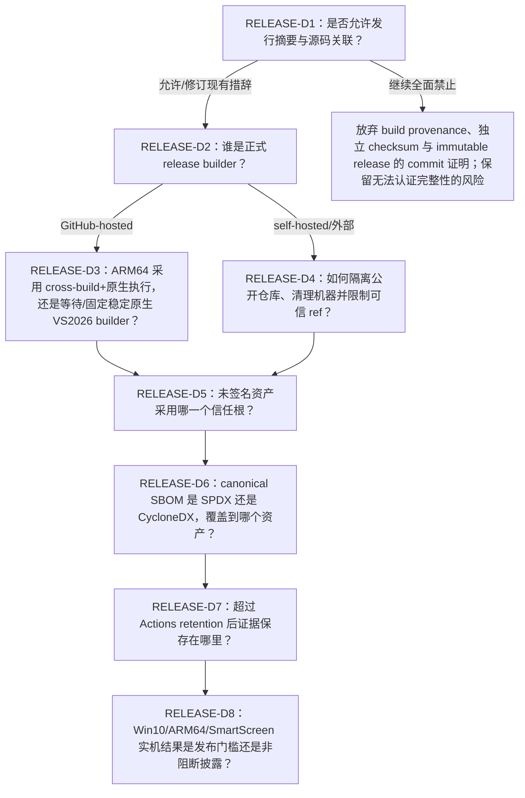

# 公开构建来源、CI 与发行证据研究

- 状态：研究结论与候选工程门禁，**不是已接受的产品决定、法律意见、发布批准或真实环境通过记录**
- 研究日期：2026-08-10（北京时间）
- 查询日期：2026-08-10；GitHub 托管镜像和在线文档会继续变化，正式发布时必须重新取证
- 适用范围：公开 GitHub 源码仓库、C++/WinRT + XAML + Windows App SDK 构建、x64/ARM64 制品、未签名 ZIP/Win32/传统安装器、GitHub Actions、GitHub Releases、SBOM、许可与 NOTICE、Windows 实机证据
- 来源边界：只采用 GitHub Docs、GitHub 官方 `actions/*` 仓库、Microsoft Learn、Microsoft 官方仓库、SPDX 与 CycloneDX 一手资料。通过 `agent-reach` 的 GitHub CLI 和 Jina Reader 读取；Exa 在本次环境中不可用，未用博客、论坛或二手教程补空白
- 操作边界：没有创建 workflow、运行 Windows 构建、上传制品、启用 Actions、修改 Release、规格、ADR、事项或领域文档
- 后续决定：本研究完成后，维护者已先按 [ADR-0044](../adr/0044-github-actions-for-automatic-beta-release.md) 选择 GitHub Actions 作为自动 beta 发布载体，随后由 [ADR-0045](../adr/0045-separate-read-only-ci-from-release-permissions.md) 取代其“首次源码基线保持关闭”的时序；下文“尚未决定”的表述保留为研究时点记录，不再代表当前决定前沿。

本文把四类容易混淆的事实分开：**构建发生在哪里**、**下载字节是否与参照一致**、**字节是否能追溯到某个源码与工作流**、**字节是否在目标 Windows 上真实可用**。任一类证据都不能自动替代另外三类。

## 1. 结论摘要

### P0-1：现行“无校验值或源码提交关联”与 GitHub 当前发行能力直接冲突

[ADR-0005](../adr/0005-unsigned-releases.md) 和主规格 `SEC-05` 明确要求发行版不提供 SHA-256 校验值或源码提交关联。GitHub 当前 REST release asset 响应已经包含 `sha256:` digest；immutable release 还会自动生成包含 release tag、commit SHA 与资产的 release attestation；build provenance attestation 的目的则正是把制品关联到仓库、提交和工作流。[G08][G11][G14]

因此开始设计发行 CI 前必须先由维护者明确以下哪一种解释成立，本文不代答：

- “不提供”仅表示项目不另附 `SHA256SUMS`，但允许 GitHub 平台显示 digest、release attestation 和源码关联；
- 仍禁止任何项目或平台可见的摘要与源码关联，因而放弃本文所述 provenance、immutable release 验证和独立校验清单；
- 修订 ADR-0005、`SEC-05`、`UPD-03` 与相关事项，让“未做 Windows 代码签名”和“仍提供字节完整性/构建来源证据”成为两个不同决定。

在该问题闭合前，不能一边声称“无校验信息”，一边把 GitHub digest 或 attestation 当作正式发行保证。

### P0-2：GitHub 托管 Windows runner 不能覆盖 Windows 10 22H2

截至查询日，标准 GitHub-hosted Windows runner 在公开和私有仓库都提供 x64 与 ARM64：x64 是 Windows Server 2022/2025，ARM64 是 Windows 11 Enterprise。没有 Windows 10 22H2 标签或镜像。[G01][G03][G04][G05][G06]

所以：

- x64 托管 runner 可以构建 x64，也可以用 MSVC cross tools 生成 ARM64；
- ARM64 托管 runner 可以提供 Windows 11 ARM64 原生执行证据；
- 两者都不能证明 Windows 10 22H2 兼容；
- GitHub 托管 Windows runner 以管理员身份运行且 UAC 被关闭，不能证明真实 UAC 提示、标准用户路径或普通消费者环境行为。[G01]

Windows 10 22H2、真实 UAC 和 SmartScreen 证据只能来自受控实机/虚拟机或外部人工验收。把这种机器直接接成公开仓库的长期 self-hosted runner 又会引入严重的持久化攻陷风险，必须单独决定隔离方式。[G02][G07]

### P0-3：当前 ARM64 runner 与“固定稳定 VS 2026 工具链”没有天然闭合

`windows-11-arm` 当前镜像是 Windows 11 ARM64，但预装 Visual Studio 2022；`windows-11-vs2026-arm` 预装 Visual Studio 2026，却仍被官方标为 public preview。查询日镜像清单中的 VS 2026 版本为 18.7，而项目工具链研究锁定的候选稳定版是 18.8.2。[G04][G05]

同时，runner images 通常每周更新；固定 `windows-2025` 或 `windows-11-arm` 只固定镜像系列，不固定其中每一个工具版本。实际 image version 和软件版本必须从当次 job 的 `Set up job` 日志取证。[G03]

可行候选包括“x64 稳定 runner cross-build ARM64，再在稳定 `windows-11-arm` 上只执行 self-contained ARM64 测试”或“隔离的固定版本 ARM64 self-hosted 构建机”。前者仍不等于 ARM64 原生构建，后者仍有 self-hosted 安全与维护成本；`windows-11-vs2026-arm` 在保持“不依赖 preview”时只能作为实验性证据，不能静默成为正式 release builder。

### P0-4：Actions artifact 不是长期发行档案

workflow artifact 默认保留 90 天。公开仓库允许 1 至 90 天，私有仓库允许 1 至 400 天；设置只影响新对象。workflow run 被删除时，其 artifact 也会被删除。[G16][G17][G18]

`upload-artifact` 返回 SHA-256 digest，`download-artifact` 会重新计算并比较；这可以发现 Actions artifact 的传输不一致，但不能把临时 artifact 变成永久、公开、不可撤销的发行证据。[G15] 正式发行证据若只存在于 workflow artifact 和 job log，最迟 90 天后就不能依赖 GitHub 默认保留策略重验。

### P0-5：SBOM 可生成，但“生成成功”不等于依赖与许可闭合

Microsoft SBOM Tool 能对最终 drop 中每个文件计算摘要，并从 build component 路径检测组件，生成/验证 SPDX 2.2 或 3.0；其 Component Detection 当前覆盖 NuGet、vcpkg 和 Conan 等输入，但不同 detector 的图关系与准确性有已知限制。[M07][M08] vcpkg 还会按 triplet 为每个已安装 port 生成 SPDX 2.3 文件。[M09]

CycloneDX 1.7 可以表达组件、直接/传递依赖、许可、完整性状态和构建 formulation；官方 CLI 可以增加文件、合并、转换、比较和校验 BOM，但不是通用 C++ 依赖发现器。SPDX 与 CycloneDX 转换可能丢信息。[C01][C02][M09]

因此 SBOM 门禁必须把**锁文件、解析后依赖图、最终文件树、PE import、许可/NOTICE**相互对账。`NOASSERTION`、漏掉运行时 DLL、只扫源码清单或只校验 JSON schema，都不能证明公开再分发义务已经满足。[S02]

## 2. 现有项目约束与本研究边界

| 已有文档 | 已确认内容 | 本研究发现的衔接问题 |
| --- | --- | --- |
| [ADR-0002](../adr/0002-github-distribution.md) | 源码仓库与 GitHub Releases 公开，提供便携版和安装版 | 可以使用公开仓库的免费标准 runner 与公开 attestation；是否启用 Actions 尚未决定 |
| [ADR-0005](../adr/0005-unsigned-releases.md)、规格 `SEC-04`/`SEC-05` | Windows 制品不做代码签名，也不附 SHA-256 或源码关联 | “不签名”与“无独立完整性/provenance”是不同技术决定；GitHub 平台当前会暴露 release asset digest |
| [ADR-0006](../adr/0006-opt-in-self-update.md) | 主动一键更新，但告知无完整性校验 | 若以后采用 digest/attestation，更新合同及文案必须同步；本文不替维护者改变更新信任根 |
| [ADR-0022](../adr/0022-cpp26-with-newest-stable-toolchain.md) | 最新稳定工具链，禁止未稳定能力进入稳定接口 | GitHub ARM64 + VS 2026 镜像仍为 preview；所有 hosted image 内工具版本会滚动 |
| [事项 21](../../.scratch/windows-initial-setup-workbench/issues/21-release-artifacts.md) | 固定稳定工具链、x64/ARM64、自包含、GitHub Releases | 尚未定义 build provenance、SBOM、证据保留和 runner 责任 |
| [事项 22](../../.scratch/windows-initial-setup-workbench/issues/22-release-acceptance.md) | 实机验证非首版发布门槛，缺失时开发者证据写“未实机验证” | CI 结果必须继续与真实 Windows/SmartScreen 结果分栏，不能用绿色 workflow 淹没缺口 |
| [事项 30](../../.scratch/windows-initial-setup-workbench/issues/30-public-repository-baseline.md) | 审计后启用默认只读 Actions；事项 01 才拥有早期 CI 工作流 | 不等于后续 release CI 已获授权；发布权限仍由事项 34 在所有前置完成后单独取得 |
| [工具链研究](./preimplementation-toolchain-baseline-2026-08-10.md) | VS/MSVC/SDK/WinUI 候选、cross-build 与原生执行分离 | 本文补充 GitHub runner、证据保留和发布 provenance，不覆盖工具链结论 |
| [特权下载安全研究](./elevated-download-execution-security.md) | 摘要、签名、TLS、SmartScreen 的保证不同 | 本文只处理工作台自身发行物和 CI，不替代第三方下载执行合同 |
| [第三方再分发研究](./third-party-binary-redistribution-baseline.md) | 第三方资源逐项许可与 NOTICE 门禁 | SBOM 只能提供清单输入，不能把“无法证明再分发”自动升级为允许 |

## 3. GitHub-hosted Windows runner 事实

### 3.1 公开与私有仓库矩阵

截至 2026-08-10，GitHub 官方表格如下。[G01]

| 仓库可见性 | 架构 | 标准 runner 标签 | 资源 | 本项目可直接得到的证据 |
| --- | --- | --- | --- | --- |
| public | x64 | `windows-latest`、`windows-2025`、`windows-2025-vs2026`、`windows-2022` | 4 CPU、16 GB RAM、14 GB SSD；标准 runner 免费且不限分钟 | Windows Server 上的 x64 构建/执行；若装有 cross tools，可生成 ARM64 |
| private | x64 | `windows-latest`、`windows-2025`、`windows-2022` | 2 CPU、8 GB RAM、14 GB SSD；消耗配额并按分钟计费 | Windows Server 上的 x64 构建/执行；官方私有表未列 `windows-2025-vs2026` |
| public | ARM64 | `windows-11-arm`、`windows-11-vs2026-arm` | 4 CPU、16 GB RAM、14 GB SSD | Windows 11 ARM64 原生执行；后一个 VS 2026 镜像仍为 preview |
| private | ARM64 | `windows-11-arm`、`windows-11-vs2026-arm` | 2 CPU、8 GB RAM、14 GB SSD | Windows 11 ARM64 原生执行；私有仓库也列出两个标签 |

需要额外保留的限制：

- `-latest` 只表示 GitHub 提供的最新稳定镜像，不保证是操作系统厂商的最新版本；本项目又禁止浮动 latest，正式构建不应只记录这个别名。[G01]
- x64 官方镜像分别是 Windows Server 2022/2025；ARM64 官方镜像是 Windows 11 Enterprise。查询日 ARM64 OS build 为 26200 系列，不是 Windows 10 22H2 build 19045。[G03][G04][G05][G06]
- `windows-11-arm` 查询日预装 VS 2022 17.14；`windows-11-vs2026-arm` 和 `windows-2025-vs2026` 查询日预装 VS 2026 18.7。镜像每周滚动，不能把这些快照版本硬编码成永久事实。[G03][G04][G05][G06]
- GitHub 为 Windows、macOS、Ubuntu 及 ARM runner image 发布 SBOM；它描述镜像预装内容，不证明这些工具都参与了本次构建，也不替代项目制品 SBOM。[G07]
- larger runner 的 custom image 安装平台当前列出 Linux x64、Linux ARM64 或 Windows x64，没有提供“Windows 10 22H2 ARM64 hosted image”这一保证。[G19]

### 3.2 固定工具链的取证要求

固定 runner 标签不等于固定工具链。每一次候选 release build 至少应把以下事实写入机器可读 build manifest：

- runner label、实际 OS 名称/版本/build、处理器架构；
- GitHub image version，以及对应 `actions/runner-images` release/SBOM 标识；
- Visual Studio edition/channel/full version、MSVC toolset 和 `cl /Bv`；
- MSBuild、CMake、Ninja、NuGet、Windows SDK、Windows App SDK 精确版本；
- 所用 host/target toolchain（例如 x64 host → ARM64 target）和实际编译/链接命令摘要；
- 所有 lock file 与关键构建输入的 SHA-256；
- workflow repository/path、source commit、run ID、run attempt、触发 ref/event；
- 是否存在 preview、动态安装或 runner 预装版本偏离，偏离时的阻断结果。

GitHub 官方建议从当次 `Set up job` 日志确认实际 image 和软件版本；MSBuild binary log 能保存详细构建事件，但默认会嵌入项目及导入文件，因此原始 binlog 公开前还要审计路径、属性、命令行和潜在秘密，不能无条件作为公开 Release 资产。[G03][M06]

### 3.3 cross-build、runner 与真实平台的边界

MSVC 官方支持 x64 host 生成 ARM64 target，并允许 `vcvarsall.bat` 同时固定 host/target、Windows SDK 和 toolset。[M01] 这只证明编译器/链接器接受源码并生成目标机器格式：

| 行为 | 能证明 | 不能证明 |
| --- | --- | --- |
| x64 runner 生成 ARM64 | ARM64 配置可还原、编译、链接、打包；PE machine 可检查为 ARM64 | ARM64 CPU 上能启动、测试通过、性能正确；Windows 10 ARM64 兼容 |
| `windows-11-arm` 执行 ARM64 测试 | ARM64 Windows 11 上目标二进制真实执行；VSTest 官方要求 ARM 机器用命令行入口 [M13] | Windows 10、普通用户/UAC、WinUI 交互、安装/卸载、SmartScreen |
| x64 Windows Server runner 执行 x64 测试 | Windows Server 上核心/合同/无界面测试真实执行 | Windows 10/11 Desktop shell、资源管理器、消费者策略和 GPU/触摸环境 |
| self-hosted Windows 10 22H2 | 该具体镜像/设备、策略、架构的实际行为 | 其他 Windows build、其他 OEM/驱动、GitHub-hosted 可复现性 |
| 真实 GitHub Release 浏览器下载 | 当次文件哈希、URL/文件信誉、策略与 Mark-of-the-Web 相关路径 | 未来版本或另一设备的相同提示；制品安全无恶意 |

Windows 10 on Arm 只能模拟 x86；Windows 11 才增加 x64 模拟。项目面向 Windows 10 ARM64 时，必须执行原生 ARM64 制品，不能把 x64 在 Windows 11 ARM64 上的模拟成功外推过去。[M02]

### 3.4 self-hosted Windows 10 的安全边界

GitHub 允许 self-hosted runner 使用自管硬件、操作系统与软件，机器可以是物理机、虚拟机、容器、本地或云端。[G02] 但 GitHub 同时明确：

- hosted runner 是临时、干净、隔离 VM；
- self-hosted runner 没有每次干净的保证，可被不可信 workflow 持久攻陷；
- self-hosted runner 几乎不应直接用于公开仓库，因为任意人可发 PR 尝试攻陷环境；
- JIT runner 最多执行一个 job，但复用底层硬件仍需要外部自动化保证干净环境。[G07]

因此“接一台 Windows 10 测试机到公开仓库”不是低成本补一行 matrix。可讨论的候选是：完全不接入 GitHub、由人工导入签名/摘要可对账的测试报告；或只允许受保护 ref/维护者批准、每次恢复干净快照、无长期秘密、网络隔离的专用 runner。采用哪一种属于 `RELEASE-D4`，本文不确认。

## 4. GitHub 证据机制分别证明什么

### 4.1 对照表

| 机制 | 产生/验证方式 | 能证明 | 不能证明 | 生命周期 |
| --- | --- | --- | --- | --- |
| 本地 SHA-256 | Windows `Get-FileHash`；与受信参照比较 | 下载文件与参照摘要字节一致；单字节变化会改变摘要 [M03] | 参照属于谁、软件安全、兼容；同一攻击者能替换文件和参照时无独立身份保证 | 由发布者保存方式决定 |
| Actions artifact digest | `upload-artifact` 输出 digest；`download-artifact` 重算比较 | Actions artifact 上传/下载对象一致；v4 artifact 内容不可原位追加/覆盖 [G15] | 永久存在、公开发行、源码来源、运行通过 | public 1-90 天；run 删除即删除 [G16][G18] |
| Release asset digest | Release REST API `digest: sha256:...`；本地重算或平台命令比较 | 本地资产与 GitHub 上该 release asset 精确一致 [G14] | 资产由哪份源码构建、是否安全、是否适用目标 OS | 随 release；非 immutable release 仍可删旧资产再上传新资产 |
| Build provenance attestation | Actions `attest` 对最终文件生成；`gh attestation verify` | subject digest 与 GitHub 仓库/组织、commit、event、workflow/OIDC 身份的加密关联 [G08][G09][G10] | artifact 安全、无漏洞、测试通过、可重现、目标 Windows 兼容 [G08] | attestation 可被仓库管理者删除；可下载 bundle 离线留存 [G20][G21] |
| SBOM attestation | 先生成 SBOM，再用 `attest` 的 `sbom-path` 关联目标资产 | 某份 SPDX/CycloneDX SBOM 与 subject digest 的签名关联 [G09] | SBOM 完整/正确、许可义务已履行、遗漏组件不存在 | 同 attestation 生命周期 |
| Immutable release | 仓库先启用；draft 附齐资产后 publish；`gh release verify` | 发布后 tag 锁定 commit，资产不能修改/删除；自动 release attestation 记录 tag、commit、assets [G11][G12] | 资产确由该 commit 的源码构建；release 说明正确；软件安全/兼容 | 只作用于启用后的未来 release；删除 release 后 tag 名仍不可重用 [G11][G12] |
| Immutable release asset 验证 | `gh release verify-asset TAG FILE` | 本地文件精确匹配 immutable release asset [G13] | build provenance、Windows 代码签名、SmartScreen 结果 | 依赖 release 与 GitHub 验证材料可取得 |
| 测试报告/日志 | CTest/VSTest/TRX、环境与用例元数据 | 指定程序在指定环境执行并得到记录结果 | 未执行平台、未覆盖路径、来源真实性；日志可伪造或误配置 | Actions 日志默认 90 天，需另行归档 |

### 4.2 Artifact attestation 的信任边界

Artifact attestations 对公开仓库在当前 GitHub plans 可用；Free/Pro/Team 的私有仓库不可用，私有/内部仓库需要 GitHub Enterprise Cloud。[G09] 公开仓库使用 Sigstore Public Good Instance，并写入公开透明日志；私有仓库使用 GitHub 自有 Sigstore instance，不写公开透明日志。[G08]

验证时只给 `--owner` 或 `--repo` 是最低身份约束。更精确的 release policy 还可固定 signer workflow、signer repository、source ref 和 source digest。[G10] GitHub CLI 手册特别指出：证书身份与已验证时间戳不可由发起 workflow 篡改，但 predicate 中的用户可控内容在 workflow 执行环境被攻陷时可以伪造；受信 reusable workflow 可缩小这一风险。[G10]

因此合格的验证记录不能只写“`gh attestation verify` 成功”，还应记录：

- 验证的文件 SHA-256 和准确路径；
- 要求的 repository/owner；
- 允许的 signer workflow 与其 digest；
- 允许的 source ref/source commit；
- predicate type（build provenance 或具体 SBOM）；
- GitHub CLI 版本、在线/离线模式、bundle 与 trusted root 版本；
- 结构化验证结果的保存位置。

GitHub 明确警告 attestation 不是“artifact 安全”的保证；它只把消费者带回源码和构建指令，风险政策仍由消费者/项目定义。[G08]

### 4.3 离线验证

GitHub 支持先下载 attestation bundle 和 trusted roots，再用 `--bundle` 与 `--custom-trusted-root` 离线验证。[G20] 但离线 trusted root 不会自动获知后续撤销，Sigstore key material 每年可能轮换数次；每次向隔离环境导入新签名材料时应更新 trusted root。[G20]

这意味着“断网救援版附一份旧 trusted root”不能永久证明未来发行物。若维护者选择提供离线验证包，必须同时定义 root 更新、撤销信息新鲜度和旧发行重验政策；本文不替维护者选择该信任根。

## 5. 未签名制品的独立清单与 provenance 候选

Windows PE/安装器继续不做代码签名，并不妨碍项目另行提供文件摘要、build provenance 或 SBOM；这些证据也不会让 UAC 显示已验证发布者，不能消除 SmartScreen 对未签名文件的行为。[M04]

### 5.1 每个 release 的候选证据包

以下是可组合的候选，不是已经接受的发行合同：

1. **`release-manifest.json`**：版本化 schema；逐资产记录规范文件名、字节数、SHA-256、内容版、打包形态、目标架构、source commit、workflow/run、工具链清单摘要、SBOM/NOTICE 文件与摘要。
2. **`SHA256SUMS`**：便于 `Get-FileHash` 或其他独立工具逐文件对照；其真实性取决于维护者选择的信任根。
3. **逐最终资产 build provenance attestation**：目标应是用户实际下载的 ZIP/EXE/MSI，而不是打包前目录或随后会改变字节的中间文件。
4. **逐资产 SBOM 或“公共基础 + 明确 delta”SBOM**：必须能映射到具体 x64/ARM64、便携/安装、内容版资产，不能只有一个无法判断覆盖范围的全局 BOM。
5. **`LICENSES/` 与 `THIRD-PARTY-NOTICES`**：保留要求随附的原始许可与通知；另有机器可读组件→许可文件→再分发证据映射。
6. **构建/验证摘要**：保存源提交、toolchain、测试、PE machine/import、最终文件树、未执行的实机矩阵和所有 exception；公开版本先脱敏，原始 binlog/日志按访问控制另存。
7. **Attestation bundle 与验证说明**：若选择离线留档，记录 trusted root 取得时间和过期/撤销限制。

### 5.2 可选信任根，不代替维护者选择

| `RELEASE-D5` 候选 | 消费者实际信任什么 | 优点 | 剩余缺口 |
| --- | --- | --- | --- |
| GitHub repository + immutable release + GitHub/Sigstore attestation | GitHub 账号/仓库治理、OIDC、GitHub/Sigstore root 和指定 workflow | 与公开源码、tag、asset digest 集成；验证工具现成 | 仓库/工作流治理仍是核心；不产生 Windows publisher identity |
| 单独签名的 release manifest/SBOM | 维护者选定的离线密钥、证书或透明日志，以及该公钥的独立分发 | 可脱离 GitHub 下载通道验证清单 | 密钥生成、保管、轮换、撤销、继任与首信任仍未定义 |
| 独立发布摘要的第二渠道 | 第二域名/仓库/公告渠道的身份与控制权 | 文件与同一 Release 页面被同时替换的难度上升 | 两个渠道若同账号/同恢复链控制，独立性可能只是表面 |
| 不设真实性信任根，只提供普通摘要 | 用户先自行信任某处看到的 SHA-256 | 可发现传输损坏和与参照不一致 | 不能认证发布者；与 ADR-0005 当前风险基本相同 |

`Get-FileHash` 能证明本地内容和参照摘要相同，不能自行证明参照来源。[M03] 因此“提供 SHA-256”必须与 `RELEASE-D5` 一起决定，不能把 hash 算法本身称为信任根。

## 6. SBOM、许可/NOTICE 与构建清单

### 6.1 SPDX 候选路径

SPDX 当前版本为 3.0，2.3 仍是受支持的前一版本；SPDX 是 ISO/IEC 5962:2021 国际开放标准。[S01] 对本项目最直接的候选是：

- 用 Microsoft SBOM Tool 扫最终发行 drop 与 build components，生成 SPDX 2.2 或 3.0；所有最终文件进入 files section 并计算摘要；随后用同一工具对 drop 验证。[M07]
- 如果采用 vcpkg，保留每个 triplet 下由 vcpkg 生成的 `vcpkg.spdx.json`，再与最终应用 SBOM 建立明确关系；vcpkg 文件记录 port、binary package、source resource、相对文件和 checksum。[M09]
- Component Detection 的 NuGet detector 应以 `project.assets.json`/`packages.config` 等解析结果为主，避免扫描全局包缓存造成过报；vcpkg detector 依赖实际安装树中的 SPDX，Conan detector 依赖 `conan.lock`。[M08]
- NuGet `PackageReference` 项目应生成并提交 `packages.lock.json`，release restore 使用 locked mode；官方文档说明 locked mode 要么恢复 lock 中精确包，要么在依赖变更时失败。[M05]

SPDX 2.3 明确区分 declared license、concluded license、从文件观察到的 license，并允许 `NONE`/`NOASSERTION`；concluded 与 declared 不同或为 `NOASSERTION` 时应写解释。[S02] 因而自动填入的外部许可元数据不能直接变成“许可已审核”。

### 6.2 CycloneDX 候选路径

CycloneDX 1.7 能表达：

- 第一方/第三方组件、hash、许可与 copyright；
- 直接和传递依赖图；
- composition 完整性（complete/incomplete/unknown）；
- build/post-build 生命周期和 formulation；
- SPDX license expression 与 declared/concluded/observed license evidence。[C01][C03]

官方 CycloneDX CLI 可以给 BOM 增加最终文件、merge/diff/convert/validate，并可在校验错误时返回非零；它不会凭空发现 C++/WinUI 的完整依赖。[C02] 若从 vcpkg SPDX 转成 CycloneDX，Microsoft 与 CycloneDX 都警告转换可能丢依赖信息。[M09][C02]

所以若维护者选择 CycloneDX，必须同时选择真正理解实际包管理器/构建输出的 producer，并用官方 CLI 做 schema、合并和差异验证。不能把“SPDX 转 CycloneDX 成功”当作信息等价证明。

### 6.3 五份清单必须对账

| 清单 | 权威输入 | 必须发现的差异 |
| --- | --- | --- |
| 声明依赖 | `PackageReference`、vcpkg/Conan manifest、安装器依赖声明 | 浮动版本、未锁定源、只在某架构出现的依赖 |
| 解析依赖 | `packages.lock.json`、`project.assets.json`、vcpkg SPDX、Conan lock | 未声明传递依赖、恢复结果偏离 lock、dev/test 依赖误入发行 |
| 最终文件 | 解包后的 ZIP/安装器 payload；路径、size、SHA-256 | 未识别 DLL/EXE、同名异字节、x64/ARM64 混装、意外 .NET runtime |
| PE/运行时依赖 | 每个 PE 的 `Machine`、`DUMPBIN /DEPENDENTS`/imports、干净机运行 | 错误 machine、缺失 runtime、只在动态加载时出现的依赖 |
| 许可与 NOTICE | 上游精确版本 LICENSE/EULA/NOTICE、再分发证据登记 | `NOASSERTION`、版本不匹配、需要随附却缺失的文本、禁止再分发组件 |

PE/COFF 的 machine field 可客观区分 x64 (`0x8664`) 与 ARM64 (`0xAA64`)；`DUMPBIN /HEADERS` 显示文件/section headers，`/DEPENDENTS` 只列 image 静态导入函数所依赖的 DLL 名称。[M10][M11][M12] 这些扫描不能发现所有运行时 `LoadLibrary`、COM 激活、安装器下载或 OS feature 依赖，仍需干净机/断网执行。

### 6.4 NOTICE 门禁

SBOM 的 license 字段是事实清单，不是履约动作。候选 release gate 应逐组件保留：

- 精确上游身份、版本、架构、原资产名和来源；
- declared/concluded/observed license 及差异说明；
- 必须随附的 LICENSE、NOTICE、ThirdPartyNotices、EULA 和 source offer；
- 这些文本在发行包中的稳定路径与 SHA-256；
- 再分发依据、复核人、复核日期和 exception 到期条件；
- SBOM component 与实际发行文件的双向映射。

未知许可、`NOASSERTION` 或没有对应最终文件映射的组件必须阻断随附发布，不能静默从报告中过滤。显式 exception 只能记录扫描器误报、已由另一条 `accepted` 证据覆盖的机器可验证映射，或把对象隔离在不进入制品的队列中；它不能把未知许可本身升级为再分发授权。许可结论仍以[第三方再分发研究](./third-party-binary-redistribution-baseline.md)和后续逐项审核为准。

## 7. 候选 CI 与发行阶段

以下只是阶段划分，不是 workflow 代码，也不表示 Actions 已获授权。

| 阶段 | 建议输入 | 候选产物/门禁 | 证据边界 |
| --- | --- | --- | --- |
| CI-00 来源与权限 | protected ref/tag、完整 source SHA、审核后的 workflow | action 全长 commit SHA、最小 `GITHUB_TOKEN` 权限、无不可信 checkout 进入 privileged job | GitHub 说明全长 commit SHA 是 action 不可变引用的唯一方式 [G07] |
| CI-01 工具链取证 | 固定 runner series 与依赖安装定义 | runner/image/OS、VS/MSVC/SDK/CMake/NuGet 全版本；偏离即失败 | runner label 不固定内部版本 |
| CI-02 锁定恢复 | NuGet/vcpkg/其他 lock 与固定源 | locked restore、解析依赖图、输入摘要、无 floating latest | 成功恢复不证明许可/最终携带 |
| CI-03 x64 构建与无界面测试 | 同一权威构建入口 | Release x64、CTest/VSTest/TRX、MSBuild binlog、warning/error summary | Windows Server 结果不等于 Desktop 实机 |
| CI-04 ARM64 cross-build | x64 host + ARM64 target toolchain | Release ARM64、编译/链接记录、PE machine 扫描 | 不冒充 ARM64 原生执行 |
| CI-05 ARM64 原生执行 | `windows-11-arm` 或隔离实机 | 同一核心/合同测试在 ARM64 CPU 执行；进程 architecture 记录 | 不覆盖 Win10；VS2026 preview builder 不能静默使用 |
| CI-06 打包矩阵 | 已通过构建的同一 core/runtime；内容清单 | 每个内容版×形态×架构的规范文件名、实际 payload 与 archive 列表 | 不能只凭文件名推断内容 |
| CI-07 二进制与依赖扫描 | 解包后的每个最终制品 | 全文件 SHA-256、PE machine、imports、runtime/.NET 禁令、安装器 payload 对账 | 静态扫描不替代干净机启动 |
| CI-08 SBOM/许可 | 解析依赖、最终 drop、上游许可文本 | SPDX/CycloneDX validate；五表对账；NOTICE/许可阻断项与已授权扫描 exception 报告 | schema valid 不等于 complete；许可未知不能由 exception 放行 |
| CI-09 临时证据归档 | 测试、扫描、manifest、SBOM | Actions artifacts 及其 digest；明确 retention-days | 临时调试/审批输入，不是永久发行档案 |
| CI-10 候选审核 | 所有 CI 结果、人工许可审查、实机状态 | 机器可读 gate summary；每项 `pass/fail/not-run/waived` 与责任人 | `not-run` 不得转换成 pass |
| REL-01 provenance | 最终用户下载字节 | 每个资产 build attestation；SBOM attestation（若采用） | 必须发生在最后一次字节修改之后 |
| REL-02 draft upload | 完整资产、manifest、SBOM、NOTICE | GitHub 返回 digest 与本地 digest 对账；草稿内资产集合冻结 | 仍未发布，不是用户验收 |
| REL-03 immutable publish | 已启用 release immutability 的仓库 | 一次 publish；自动 release attestation；tag/assets 锁定 | 事后缺资产只能发布新版本，不能修改旧资产 |
| REL-04 发布后重验 | 从 Release 重新下载的每个资产 | `gh release verify`、`verify-asset`、`gh attestation verify` 及结构化结果 | 仍不证明 SmartScreen/目标 OS |
| EXT-01 真实 Windows | 干净 Win10/Win11、x64/ARM64、普通用户/管理员 | 安装、便携、离线、升级/卸载、UI/UAC/恢复报告 | 与 CI 结果单独展示 |
| EXT-02 SmartScreen | 从真实公开 Release 经浏览器取得的精确字节 | OS build、策略、下载 URL、asset SHA-256、提示/阻断结果 | 只对该文件 hash、设备、时点成立 [M04] |

`CI-09` 的 artifact digest 应与 `REL-02` release asset digest 再对账，防止“测试的是 A，上传的是 B”。但正式来源证明应绑定 `REL-01` 的最终资产；只 attest 一个中间 ZIP 后重新压缩、重命名内容或生成安装器会使证明链中断。

## 8. P0 / P1 工作队列

### 8.1 P0：设计 release pipeline 前必须闭合

1. **`RELEASE-D1`：解释或修订“无 SHA-256/源码关联”**。不闭合就不能同时采用 release digest、build provenance、SBOM attestation 与 immutable release 的 commit 关联。
2. **`RELEASE-D2`：确定 release build authority**。明确 GitHub-hosted、隔离 self-hosted 或外部 builder 哪一个拥有“正式制品”资格，其他构建只作测试。
3. **`RELEASE-D3`：固定 VS 2026/ARM64 路径**。解决 ARM64 VS2026 hosted image 为 preview、稳定 ARM runner 只有 VS2022、hosted image 工具滚动的问题。
4. **`RELEASE-D4`：定义 Windows 10/self-hosted 隔离**。公开 PR 不得直接进入长期 Windows 10 release/test machine；决定人工导入证据或 JIT/快照方案。
5. **`RELEASE-D5`：选择未签名制品的信任根**。至少明确 checksum manifest 的真实性由 GitHub attestation、单独密钥、第二渠道还是无认证参照承担。
6. **`RELEASE-D6`：选择 canonical SBOM 格式与覆盖单位**。决定 SPDX/CycloneDX、版本、每资产或公共+delta，及 `NOASSERTION`/遗漏的门禁。
7. **`RELEASE-D7`：定义永久证据保存地**。公开仓库 Actions artifact 最长 90 天，必须决定哪些脱敏证据进入 immutable Release、源码 tag、独立档案或受控存储。
8. **公开/受限证据分级**。MSBuild binlog、日志和环境清单可能含路径、项目导入、命令行或秘密；必须定义可公开摘要与受限原件，不得为了“透明”泄露敏感信息。

### 8.2 P1：首个正式 Release 前必须完成

1. 实际运行一次固定工具链 x64 build、ARM64 cross-build、x64 原生测试和 ARM64 原生测试，并证明测试与最终资产是同一字节链。
2. 对每个最终 ZIP/安装器及其解包 payload 生成文件清单、SHA-256、PE machine/import 和 runtime 扫描；安装器外壳与安装 payload 都要覆盖。
3. 生成 canonical SBOM，完成锁文件→解析依赖→最终文件→PE imports→许可/NOTICE 对账；所有扫描 exception 有责任人与到期条件，未知许可或缺少再分发依据不得作为 exception 放行。
4. 对最终用户下载资产生成 build provenance；若采用 SBOM attestation，对相同 subject digest 生成并验证。
5. 在首次 release 前启用 immutability（若 `RELEASE-D1` 允许），先建 draft、附齐所有资产，再一次 publish；发布后重新下载并运行 release/asset/attestation 验证。
6. 把开发者发布证据中的实机矩阵逐项标成 `pass`、`fail` 或 `not-run`。若沿用事项 22，`not-run` 不阻止发布但不能消失或被 CI 绿色状态覆盖。
7. 从真实 GitHub Release 在代表性 Windows 上下载同一 SHA-256 文件，记录 SmartScreen/Smart App Control/UAC；只把结果归属于该资产、OS build、策略和日期。
8. 验证 Actions artifact 到期或 workflow run 删除后，仍能仅凭永久保存的 release manifest、SBOM、NOTICE、attestation bundle/在线记录和测试摘要重建审核结论。

## 9. 维护者决策树

本文只列问题、候选和技术后果，不替维护者作答。

| 编号 | 需要维护者回答的问题 | 研究建议的判断材料 | 不回答的后果 |
| --- | --- | --- | --- |
| `RELEASE-D1` | `SEC-05` 是禁止项目另附清单，还是禁止平台 digest/attestation 和所有源码关联？ | GitHub release asset 已暴露 SHA-256；immutable release 自动关联 commit | 正式文档与实际 GitHub 页面互相矛盾 |
| `RELEASE-D2` | 哪个环境有资格生成正式资产？ | hosted runner 临时干净；self-hosted 可固定 OS/工具但需自管安全 | 任意开发机输出都可能被误称为 release build |
| `RELEASE-D3` | ARM64 正式构建必须原生 VS2026，还是允许 x64→ARM64 cross-build并在 ARM64 原生执行？ | MSVC 支持 cross tools；VS2026 ARM hosted image仍 preview | 可能违反稳定工具链或缺 ARM64 原生执行证据 |
| `RELEASE-D4` | Windows 10/真实策略设备如何取得证据？ | GitHub 明确不建议公开仓库直接用 self-hosted；人工导入与隔离 JIT 各有成本 | 实机缺口被隐藏，或测试机成为供应链入口 |
| `RELEASE-D5` | SHA manifest/provenance 的首信任来自哪里？ | GitHub/Sigstore、独立密钥、第二渠道、无认证参照的保证不同 | “有 hash”被误写成“已认证发布者” |
| `RELEASE-D6` | SPDX/CycloneDX 哪个是唯一权威，如何按最终 Q7 制品矩阵（当前 8/12/拆分方案）映射？ | Microsoft/vcpkg 原生 SPDX 较直接；CycloneDX 表达丰富但 producer/转换需验证 | 多份 SBOM 漂移或无法判断某资产的实际依赖 |
| `RELEASE-D7` | 哪些证据永久公开，哪些受限保存，保存多久？ | public Actions 最长 90 天；raw binlog 可能含敏感上下文 | 发行数月后不可重验，或公开泄露环境信息 |
| `RELEASE-D8` | 当前“未实机验证不阻断”是否继续适用于 Win10、ARM64 和 SmartScreen？ | hosted CI 无法替代；SmartScreen 结果又只能在真实下载后取得 | 发布门槛和披露文本继续含糊 |

## 10. 验证矩阵

| 验证对象 | 最低环境 | 证据文件/记录 | 通过条件 | 必须保留的未证明项 |
| --- | --- | --- | --- | --- |
| x64 源码可构建 | 固定 x64 Windows Server builder | source SHA、toolchain manifest、binlog 摘要、x64 outputs | 固定依赖恢复，Release 编译链接成功，无禁用 warning | Win10/Win11 Desktop 与用户交互 |
| ARM64 源码可构建 | 固定 x64 cross builder 或已批准 ARM64 builder | host/target、commands、ARM64 outputs | 所有项目/生成步骤进入 ARM64 配置，PE machine 全部正确 | 若 cross-build，仍未原生执行 |
| ARM64 核心可执行 | `windows-11-arm` ARM64 | runner OS/arch、test binary hash、TRX/CTest | ARM64 进程真实运行同一测试集，零测试也视为失败 | Win10 ARM64、WinUI/安装器/SmartScreen |
| Windows 10 22H2 x64 | 干净 19045 x64 实机/VM | OS edition/build、asset hash、步骤与结果 | 同一 release asset 启动/安装/核心 smoke 符合合同 | 其他 OEM、策略与 ARM64 |
| Windows 10 22H2 ARM64 | 干净 19045 ARM64 实机/VM | CPU/OS、asset hash、原生进程架构、结果 | 原生 ARM64 asset 执行，不以 x86 模拟代替 | 环境若不可得必须写 `not-run` |
| Windows 11 x64/ARM64 | 干净 Desktop 实机/VM | OS build、asset hash、在线/离线、安装/便携结果 | 两架构实际启动、安装/卸载/升级及 UI smoke | Windows 10 不可外推 |
| SmartScreen/UAC | 真实公开 Release 浏览器下载、默认和受管策略代表样本 | URL、下载时间、asset digest、OS/策略、截图/事件记录 | 只按预先定义预期记录 warning/阻断/继续路径 | 未来 hash/策略/信誉不保证相同 |
| 文件完整性 | 每个最终 release asset | local SHA-256、GitHub release digest、manifest | 三者完全一致，文件名/size/variant 唯一 | 发布者身份取决于 `RELEASE-D5` |
| Build provenance | 每个最终 asset | attestation bundle/在线记录、结构化 verify result | subject digest、repo、source SHA/ref、signer workflow policy 全部匹配 | 安全、测试、可重现、兼容仍需其他证据 |
| Release immutability | GitHub Release | `gh release verify` 与 `verify-asset` 结果 | release 标记 immutable，tag/assets 与本地一致 | build provenance 仍单独验证 |
| 项目 SBOM | 每个 asset 或已定义公共+delta | canonical BOM、validate、component/file reconciliation | schema 正确，最终文件覆盖，已授权扫描 exception 全可追溯，未知许可为零 | 扫描器未知项不能宣称不存在或已获分发权 |
| 许可/NOTICE | 每个实际携带组件 | upstream license/notice、映射、审核状态 | 精确版本文本随附，再分发证据已接受 | 本文不是法律批准 |
| 长期可重验 | Actions artifact 已过期/删除的模拟 | immutable release 证据包或受控档案 | 不依赖临时 workflow artifact 仍能复核 asset、source、SBOM、tests | GitHub/Sigstore/外部 root 的长期可用性仍按政策管理 |

## 11. 不能由本文证明的事情

1. 没有任何 GitHub digest、attestation、SBOM 或绿色 workflow 能证明程序没有恶意、没有漏洞或一定安全。[G08]
2. Build provenance 不是 reproducible build 证明；它说明某个 workflow 对某个 digest 作出来源声明，不说明另一 builder 会产生相同字节。
3. Immutable release 锁定 tag/assets，不能单独证明这些资产由该 tag 源码构建；仍需 build provenance。
4. `DUMPBIN /DEPENDENTS` 不是完整运行时依赖解析器，不能发现动态加载、COM、系统 feature 或安装器后续下载。
5. GitHub-hosted Windows runner 不能证明 Windows 10 22H2、真实 UAC、SmartScreen、触摸、GPU、OEM 驱动或普通桌面 shell 行为。
6. SBOM schema 校验通过不能证明组件发现完整，也不能替代许可义务、NOTICE、source offer 或上游书面授权。
7. 未签名制品的外部 manifest/attestation 不会给 PE 添加 Authenticode publisher，也不能保证 SmartScreen 不警告或企业策略允许继续。[M04]
8. 本文没有批准启用 Actions、修改 ADR-0005、选择 SBOM 格式、信任根、runner 或实机门槛。

## 12. 官方来源

除单独注明外，所有来源访问日期均为 2026-08-10。GitHub runner image 清单是滚动快照，正式 release 必须保存当次 job 对应的 image version 与 release SBOM，而不是引用查询日的 `main` 分支当永久证据。

### 12.1 GitHub

| 编号 | 官方资料 | 本文用途 |
| --- | --- | --- |
| G01 | [GitHub-hosted runners reference](https://docs.github.com/en/actions/reference/runners/github-hosted-runners) | public/private x64/ARM64 表、资源、UAC disabled、`-latest` 语义 |
| G02 | [Self-hosted runners](https://docs.github.com/en/actions/concepts/runners/self-hosted-runners) | 自管 OS/hardware、物理/虚拟/云、维护责任 |
| G03 | [`actions/runner-images` README](https://github.com/actions/runner-images/blob/main/README.md) | 镜像系列、周更、当次 `Set up job` 取 image version |
| G04 | [Windows 11 Arm64 image inventory](https://github.com/actions/runner-images/blob/main/images/windows/Windows11-Arm64-Readme.md) | Windows 11 ARM64、VS 2022 与查询日 OS/image/tool 快照 |
| G05 | [Windows 11 VS 2026 Arm64 image inventory](https://github.com/actions/runner-images/blob/main/images/windows/Windows11-VS2026-Arm64-Readme.md) | VS2026 ARM preview 与查询日版本 |
| G06 | [Windows Server 2025 VS 2026 image inventory](https://github.com/actions/runner-images/blob/main/images/windows/Windows2025-VS2026-Readme.md) | x64 VS2026 runner 的 OS/image/tool 快照 |
| G07 | [Secure use reference](https://docs.github.com/en/actions/reference/security/secure-use) | action 全 SHA、最小权限、runner image SBOM、self-hosted 风险/JIT 边界 |
| G08 | [Artifact attestations](https://docs.github.com/en/actions/concepts/security/artifact-attestations) | provenance 内容、Sigstore、SLSA、不能证明安全 |
| G09 | [Using artifact attestations to establish provenance](https://docs.github.com/en/actions/how-tos/secure-your-work/use-artifact-attestations/use-artifact-attestations) | plan 可用性、binary/SBOM attestation、CLI verify |
| G10 | [`gh attestation verify`](https://cli.github.com/manual/gh_attestation_verify) | 身份约束、policy flags、可/不可篡改字段 |
| G11 | [Immutable releases](https://docs.github.com/en/code-security/concepts/supply-chain-security/immutable-releases) | tag/assets 保护、自动 release attestation、draft→publish |
| G12 | [Preventing changes to your releases](https://docs.github.com/en/code-security/how-tos/secure-your-supply-chain/establish-provenance-and-integrity/prevent-release-changes) | 仓库/组织启用、只作用于未来 release |
| G13 | [Verifying the integrity of a release](https://docs.github.com/en/code-security/how-tos/secure-your-supply-chain/secure-your-dependencies/verify-release-integrity) | `gh release verify` 与 `verify-asset` |
| G14 | [REST API endpoints for release assets](https://docs.github.com/en/rest/releases/assets) | release asset `digest`、下载与上传对象 |
| G15 | [Store and share data with workflow artifacts](https://docs.github.com/en/actions/tutorials/store-and-share-data) | artifact digest 自动比较、v4 immutability、per-artifact retention |
| G16 | [Repository Actions artifact/log retention](https://docs.github.com/en/repositories/managing-your-repositorys-settings-and-features/enabling-features-for-your-repository/managing-github-actions-settings-for-a-repository#configuring-the-retention-period-for-github-actions-artifacts-and-logs-in-your-repository) | 默认 90 天、public 1-90、private 1-400、新对象生效 |
| G17 | [Organization Actions artifact/log retention](https://docs.github.com/en/organizations/managing-organization-settings/configuring-the-retention-period-for-github-actions-artifacts-and-logs-in-your-organization) | 组织层上限与同一保留范围 |
| G18 | [Workflow artifacts](https://docs.github.com/en/actions/concepts/workflows-and-actions/workflow-artifacts) | run 删除时 artifact 一并删除 |
| G19 | [Using custom images for larger runners](https://docs.github.com/en/actions/how-tos/manage-runners/larger-runners/use-custom-images) | custom image 平台限制与 image version 记录 |
| G20 | [Verifying attestations offline](https://docs.github.com/en/actions/how-tos/secure-your-work/use-artifact-attestations/verify-attestations-offline) | bundle、trusted roots、轮换/撤销限制 |
| G21 | [Managing artifact attestations](https://docs.github.com/en/actions/how-tos/secure-your-work/use-artifact-attestations/manage-attestations) | attestation 查找、删除与消费者影响 |

### 12.2 Microsoft

| 编号 | 官方资料 | 本文用途 |
| --- | --- | --- |
| M01 | [Use the Microsoft C++ toolset from the command line](https://learn.microsoft.com/en-us/cpp/build/building-on-the-command-line?view=msvc-180) | x64→ARM64 cross tools、host/target/SDK/toolset 固定 |
| M02 | [Windows on Arm documentation](https://learn.microsoft.com/en-us/windows/arm/overview) | Windows 10/11 模拟差异、原生 ARM64、GitHub Actions ARM runner |
| M03 | [`Get-FileHash`](https://learn.microsoft.com/en-us/powershell/module/microsoft.powershell.utility/get-filehash?view=powershell-7.5) | SHA-256 默认值与内容一致性验证 |
| M04 | [SmartScreen reputation for Windows app developers](https://learn.microsoft.com/en-us/windows/apps/package-and-deploy/smartscreen-reputation) | 下载/发布者/hash 信誉、无签名逐版本归零、企业阻断 |
| M05 | [PackageReference lock files](https://learn.microsoft.com/en-us/nuget/consume-packages/package-references-in-project-files#locking-dependencies) | `packages.lock.json`、locked mode 与 CI 可重复恢复 |
| M06 | [MSBuild command-line reference](https://learn.microsoft.com/en-us/visualstudio/msbuild/msbuild-command-line-reference?view=visualstudio) | binary log 内容与 project imports 风险 |
| M07 | [Microsoft SBOM Tool](https://github.com/microsoft/sbom-tool) | SPDX 2.2/3.0 生成、final drop hashing、validate |
| M08 | [Microsoft Component Detection](https://github.com/microsoft/component-detection) | NuGet/vcpkg/Conan detector 覆盖与限制 |
| M09 | [vcpkg SBOM reference](https://learn.microsoft.com/en-us/vcpkg/reference/software-bill-of-materials) | per-triplet SPDX、字段与 CycloneDX 转换损失 |
| M10 | [`DUMPBIN /HEADERS`](https://learn.microsoft.com/en-us/cpp/build/reference/headers?view=msvc-180) | 显示 PE/COFF file 与 section headers |
| M11 | [`DUMPBIN /DEPENDENTS`](https://learn.microsoft.com/en-us/cpp/build/reference/dependents?view=msvc-180) | 静态 import DLL 名称与局限 |
| M12 | [PE format machine types](https://learn.microsoft.com/en-us/windows/win32/debug/pe-format#machine-types) | x64 `0x8664`、ARM64 `0xAA64` |
| M13 | [`VSTest.Console.exe` options](https://learn.microsoft.com/en-us/visualstudio/test/vstest-console-options?view=visualstudio) | ARM 机器的自动测试入口、退出码与零测试风险 |

### 12.3 SPDX 与 CycloneDX

| 编号 | 官方资料 | 本文用途 |
| --- | --- | --- |
| S01 | [SPDX specifications](https://spdx.dev/use/specifications/) | ISO 标准、当前 3.0 与前一版 2.3 |
| S02 | [SPDX 2.3 package information](https://spdx.github.io/spdx-spec/v2.3/package-information/) | declared/concluded/observed license、`NONE`/`NOASSERTION`、checksum/copyright |
| C01 | [CycloneDX specification overview](https://cyclonedx.org/specification/overview/) | components、dependencies、composition、formulation 与 1.7 media type |
| C02 | [CycloneDX CLI](https://github.com/CycloneDX/cyclonedx-cli) | add/merge/diff/convert/validate、SPDX 转换损失 |
| C03 | [CycloneDX 1.7 JSON reference](https://cyclonedx.org/docs/1.7/json/) | 生命周期、license evidence、component scope 与 schema |

## 13. 证据限制与复核触发器

- GitHub runner 标签、镜像版本、预装 VS/SDK、plan 可用性、artifact retention 和 attestation 功能会变化。首次编写 workflow、切换仓库可见性、升级 plan、工具链或发布前都要重新查询官方表格。
- 查询日 `actions/runner-images/main` 是当前快照，不是未来 release 的证据；实际 build 必须引用当次 image version 和对应 release/SBOM。
- 本文没有检查尚不存在的 workflow、branch protection、release 权限或维护者账号安全，不能评价真实仓库供应链成熟度。
- 本文没有在 Windows 上生成、验证或下载任何制品，也没有验证 SBOM Tool 对未来项目实际 `.vcxproj`/CMake/NuGet 布局的召回率；必须用最小工具链样机做 coverage reconciliation。
- 本文不是发布批准。所有 `RELEASE-D*` 都保持未决，只有维护者确认并回写正式规格/ADR/事项后，才能成为实施和验收依据。
